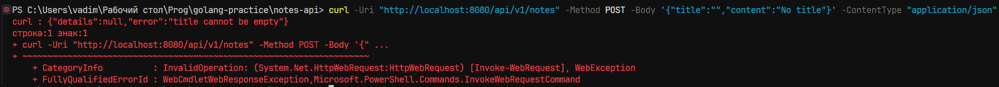
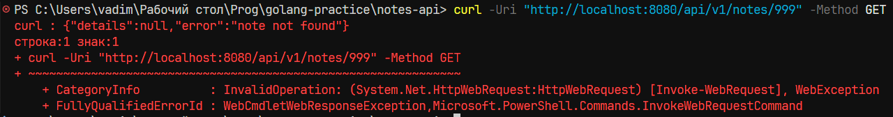
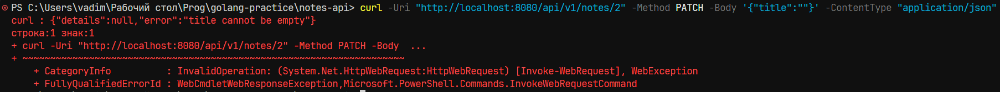
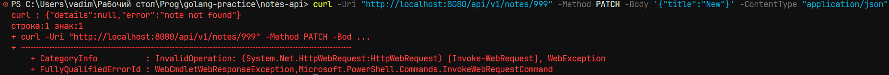
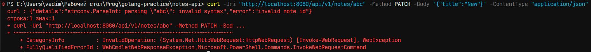
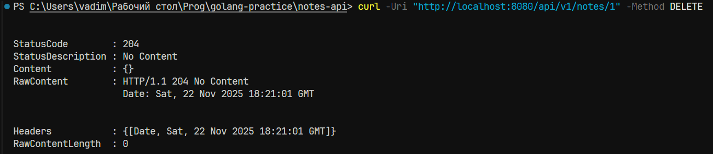
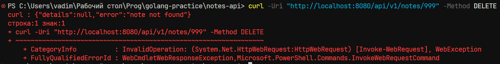

# Практическая работа № 11
Студент: Юркин В.И.

Группа: ПИМО-01-25

Тема: Проектирование REST API (CRUD для заметок). Разработка структуры


Цели:
1.	Освоить принципы проектирования REST API.
2.	Научиться разрабатывать структуру проекта backend-приложения на Go.
3.	Спроектировать и реализовать CRUD-интерфейс (Create, Read, Update, Delete) для сущности «Заметка».
4.	Освоить применение слоистой архитектуры (handler → service → repository).
5.	Подготовить основу для интеграции с базой данных и JWT-аутентификацией в следующих занятиях.


Теоретическое введение:

REST API — это архитектурный стиль для построения веб-сервисов, где все данные представлены как ресурсы с уникальными URI, а взаимодействие с ними осуществляется стандартными HTTP-методами: GET для чтения, POST для создания, PUT/PATCH для обновления и DELETE для удаления, при этом сервер не хранит состояние между запросами. CRUD (Create, Read, Update, Delete) описывает базовые операции над ресурсами, которые в REST реализуются через соответствующие HTTP-методы, позволяя клиенту создавать, получать, изменять и удалять данные структурированным и стандартизированным образом.


## Структура проекта

```
notes-api
├── cmd
│   └── server
│       └── main.go           # Точка входа приложения
├── internal
│   ├── core                   # Основные доменные интерфейсы и контракты
│   │   ├── domains.go         # Описание доменных сущностей и структур данных
│   │   ├── repos.go           # Интерфейсы репозиториев
│   │   └── service.go         # Интерфейсы сервисов
│   ├── delivery              # Слой взаимодействия с приложением
│   │   ├── http							 # Работа с HTTP запросами
│   │   │   ├── handlers        # HTTP handlers
│   │   │   │   ├── notes_handler.go  # Обработчики для /notes
│   │   │   └── middleware      # HTTP middleware
│   │   │       ├── logger.go    # Логирование запросов
│   │   │       └── recover.go   # Обработка паник в HTTP
│   │   └── router.go           # Маршрутизация HTTP запросов
│   ├── repos                  # Реализации репозиториев
│   │   └── notes_inmemory_repo.go   # Репозиторий notes в памяти
│   ├── services               # Реализация бизнес-логики
│   │   └── notes_service.go     # Сервис работы с notes
│   └── utils                  # Вспомогательные модули
│       ├── config
│       │   └── config.go      # Загрузка конфигурации из env/файлов
│       ├── http
│       │   └── http.go        # Общие HTTP-утилиты
```


## Тестирование (Windows 11)

Подготовка данных:
```bash
curl -Uri "http://localhost:8080/api/v1/notes" -Method POST -ContentType "application/json" -Body '{"title":"Note 1","content":"Content for note 1"}'
```
```bash
curl -Uri "http://localhost:8080/api/v1/notes" -Method POST -ContentType "application/json" -Body '{"title":"Note 2","content":"Content for note 2"}'
```
```bash
curl -Uri "http://localhost:8080/api/v1/notes" -Method POST -ContentType "application/json" -Body '{"title":"Note 3","content":"Content for note 3"}'
```
```bash
curl -Uri "http://localhost:8080/api/v1/notes" -Method POST -ContentType "application/json" -Body '{"title":"Note 4","content":"Content for note 4"}'
```
```bash
curl -Uri "http://localhost:8080/api/v1/notes" -Method POST -ContentType "application/json" -Body '{"title":"Note 5","content":"Content for note 5"}'
```

### 1. GET /api/v1/notes — Получить все заметки
- URL: /api/v1/notes
- Метод: GET
- Параметры: нет

Тест 1.1
- Параметры: —
- Ожидаемый результат: HTTP 200, JSON-массив из 5 заметок (ID 1–5)
```bash
curl -Uri "http://localhost:8080/api/v1/notes" -Method GET
```
Фактический результат:


### 2. POST /api/v1/notes — Создать новую заметку
- URL: /api/v1/notes
- Метод: POST
- Тело запроса: JSON {"title":"string","content":"string"}

Тест 2.1
- Параметры: {"title":"Note 6","content":"Content 6"}
- Ожидаемый результат: HTTP 200, JSON {"id":6}
```bash
curl -Uri "http://localhost:8080/api/v1/notes" -Method POST -Body '{"title":"Note 6","content":"Content 6"}' -ContentType "application/json"
```
Фактический результат:


Тест 2.2
- Параметры: {"title":"","content":"No title"}
- Ожидаемый результат: HTTP 400, ошибка "title cannot be empty"

```bash
curl -Uri "http://localhost:8080/api/v1/notes" -Method POST -Body '{"title":"","content":"No title"}' -ContentType "application/json"
```
Фактический результат:



### 3. GET /api/v1/notes/{id} — Получить заметку по ID
- URL: /api/v1/notes/{id}
- Метод: GET
- Параметры: {id} — число

Тест 3.1
- Параметры: ID = 1
- Ожидаемый результат: HTTP 200, JSON заметки с ID 1
```bash
curl -Uri "http://localhost:8080/api/v1/notes/1" -Method GET
```
Фактический результат:


Тест 3.2
- Параметры: ID = 999
- Ожидаемый результат: HTTP 404, ошибка "note not found"
```bash
curl -Uri "http://localhost:8080/api/v1/notes/999" -Method GET
```
Фактический результат:



Тест 3.3
- Параметры: ID = "abc"
- Ожидаемый результат: HTTP 400, ошибка "invalid note id"
```bash
curl -Uri "http://localhost:8080/api/v1/notes/abc" -Method GET
```
Фактический результат:


### 4. PATCH /api/v1/notes/{id} — Обновить заметку
- URL: /api/v1/notes/{id}
- Метод: PATCH
- Тело запроса: JSON {"title":"string","content":"string"}

Тест 4.1
- Параметры: ID = 1, {"title":"Updated Note 1"}
- Ожидаемый результат: HTTP 204, заголовок обновлён
```bash
curl -Uri "http://localhost:8080/api/v1/notes/1" -Method PATCH -Body '{"title":"Updated Note 1"}' -ContentType "application/json"
```
Фактический результат:


Тест 4.2
- Параметры: ID = 2, {"title":""}
- Ожидаемый результат: HTTP 400, ошибка "title cannot be empty"
```bash
curl -Uri "http://localhost:8080/api/v1/notes/2" -Method PATCH -Body '{"title":""}' -ContentType "application/json"
```
Фактический результат:




Тест 4.3
- Параметры: ID = 999, {"title":"New"}
- Ожидаемый результат: HTTP 404, ошибка "note not found"
```bash
curl -Uri "http://localhost:8080/api/v1/notes/999" -Method PATCH -Body '{"title":"New"}' -ContentType "application/json"
```
Фактический результат:




Тест 4.4
- Параметры: ID = "abc", {"title":"New"}
- Ожидаемый результат: HTTP 400, ошибка "invalid note id"
```bash
curl -Uri "http://localhost:8080/api/v1/notes/abc" -Method PATCH -Body '{"title":"New"}' -ContentType "application/json"
```
Фактический результат:




### 5. DELETE /api/v1/notes/{id} — Удалить заметку
- URL: /api/v1/notes/{id}
- Метод: DELETE
- Параметры: {id} — число

Тест 5.1
- Параметры: ID = 1
- Ожидаемый результат: HTTP 204, заметка удалена
```bash
curl -Uri "http://localhost:8080/api/v1/notes/1" -Method DELETE
```
Фактический результат:




Тест 5.2
- Параметры: ID = 999
- Ожидаемый результат: HTTP 404, ошибка "note not found"
```bash
curl -Uri "http://localhost:8080/api/v1/notes/999" -Method DELETE
```
Фактический результат:




Тест 5.3
- Параметры: ID = "abc"
- Ожидаемый результат: HTTP 400, ошибка "invalid note id"
```bash
curl -Uri "http://localhost:8080/api/v1/notes/abc" -Method DELETE
```
Фактический результат:


## Запуск

Docker: 25.0.3

Golang: 1.24.0

### Конфигурация
.env
```
# Порт, на котором запускается приложение
APP_PORT=8080
```

### Локально
1. Создание .env файла (см. .env.example)
2. Установка зависимостей
```bash
make install
```
3. Запуск сервера
```bash
make run
```

### На сервере
1. Создание .env файла (см. .env.example)
2. Развёртывание сервера
```bash
docker-compose up --build -d
```


## Вывод
Этот проект демонстрирует принципы проектирования REST-API и реализацию CRUD-интерфейса для сущности «Заметка» на Go, используя слоистую архитектуру (handler → service → repository) и обеспечивая корректную обработку запросов, валидацию данных и удобную структуру для дальнейшего расширения.
